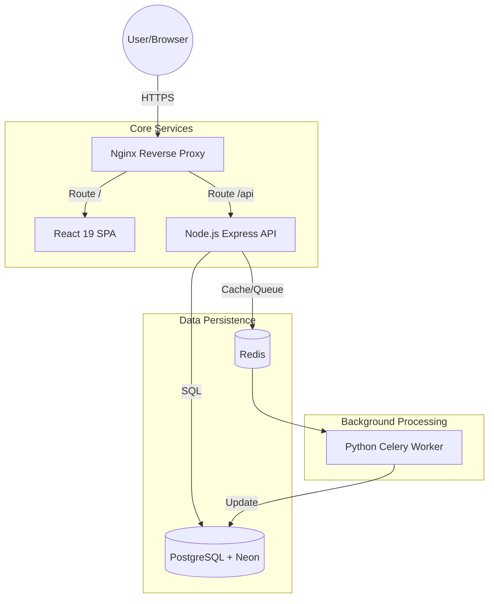

# 🏢 CoreInventory Enterprise
> **High-Performance, Multi-Tenant Inventory Management System (IMS)**

CoreInventory is an industrial-strength platform engineered for modern logistics and supply chain management. It provides a unified ecosystem to track stock lifecycle—from global procurement to final fulfillment—with enterprise-grade security and deep observability.

---

## 🏗️ System Architecture



---

## 🌟 Key Features
*   **🌍 Multi-Warehouse Tracking**: Manage stock across global hubs (NYC, London, Tokyo, etc.).
*   **🔐 Role-Based Access Control (RBAC)**: Secure access for Admins, Managers, and Staff.
*   **📦 Deep Stock Ledger**: Track every receipt, delivery, and internal transfer with a full audit trail.
*   **🤖 AI-Powered Insights**: Python-based worker for restock predictions and big data exports.
*   **🛡️ Security First**: JWT-based session management with HttpOnly cookies and CSRF protection.
*   **📊 Live Observability**: Admin-exclusive log streaming directly from the dashboard.

---

## 🚀 Getting Started

### 1. Prerequisites
*   [Node.js 20+](https://nodejs.org/)
*   [Docker & Docker Compose](https://www.docker.com/) (Optional but recommended)
*   [PostgreSQL](https://www.postgresql.org/) (Or a [Neon](https://neon.tech/) account)

### 2. Installation & Setup

#### Step 1: Clone and Install
```bash
git clone https://github.com/priyanshuKumar56/CoreInventory.git
cd CoreInventory

# Install unified dependencies
npm install
```

#### Step 2: Environment Configuration
Create a `.env` file in the **`Backend/`** directory:
```env
# Server
PORT=5000
NODE_ENV=production
CLIENT_URL=https://core-inventory-psi.vercel.app

# Database (Neon/Postgres)
DATABASE_URL=your_neon_connection_string
DB_SSL=true

# Security
JWT_SECRET=your_secure_secret_key
JWT_REFRESH_SECRET=your_refresh_secret_key

# Redis (For Python Worker)
REDIS_URL=redis://localhost:6379/0
```

#### Step 3: Database Schema & Big Data Seeding
1.  **Run Migrations**: 
    ```bash
    cd Backend
    npm run migrate
    ```
2.  **Master Seed (Showcase Mode)**:
    Open the [MASTER_SEED_BIG_DATA.sql](Backend/src/migrations/MASTER_SEED_BIG_DATA.sql) file. Copy the content and paste it into your **Neon SQL Editor** (or `psql`). This will populate:
    *   5 Global Warehouses
    *   250+ Realistic Products
    *   200+ Historical Stock Movements

---

## 🔑 Default Credentials
Use these to log in after running the **Master Seed**:

| Role | Email | Password |
| :--- | :--- | :--- |
| **Admin** | `superadmin@coreinventory.com` | `Admin@123` |
| **Manager** | `nyc.mgr@coreinventory.com` | `Admin@123` |
| **Staff** | `staff.a@coreinventory.com` | `Admin@123` |

---

## 🔄 Core Workflow

1.  **Procurement**: Create a **Receipt** to bring stock from a Supplier into a specific Warehouse Location.
2.  **Internal Move**: Use **Transfers** to shift stock between Shelves or across different Warehouses.
3.  **Audit**: Run **Adjustments** to correct physical discrepancies discovered during counts.
4.  **Fulfillment**: Process **Deliveries** to ship goods to Customers, automatically updating live stock levels.
5.  **Insights**: View the **Dashboard** for real-time charts or use the **AI Restock** tool to predict future needs.

---

## 🛠️ Tech Stack

| Component | Technology |
| :--- | :--- |
| **Frontend** | React 19, Vite, Tailwind CSS 4, Redux Toolkit, Framer Motion |
| **Backend** | Node.js, Express, Winston (Logging), JWT |
| **Database** | PostgreSQL (Neon), Node-Postgres |
| **Workers** | Python 3, Celery, Scikit-Learn (AI/ML), Pandas |
| **DevOps** | Docker, Nginx, GitHub Actions (CI/CD) |

---

## 📈 Deployment
*   **Backend**: Deployed on **Render** (using `render.yaml` Blueprint).
*   **Frontend**: Deployed on **Vercel**.
*   **CORS**: Pre-configured to allow secure communication between `coreinventory-gngv.onrender.com` and `core-inventory-psi.vercel.app`.

---

Built with precision by **Priyanshu Kumar**. 🏢📦
